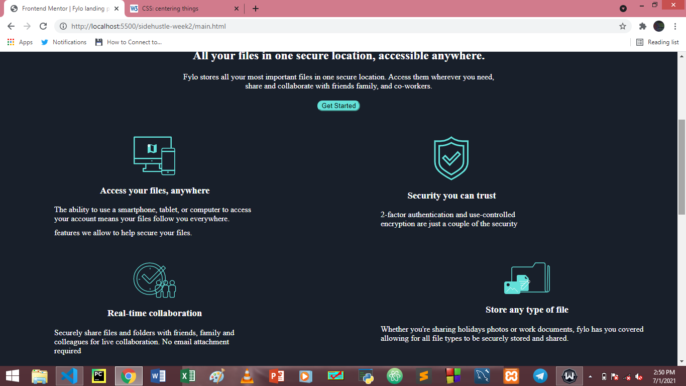

# Frontend Mentor - Fylo dark theme landing page solution

This is a solution to the [Fylo dark theme landing page challenge on Frontend Mentor](https://www.frontendmentor.io/challenges/fylo-dark-theme-landing-page-5ca5f2d21e82137ec91a50fd). Frontend Mentor challenges help you improve your coding skills by building realistic projects. 

## Table of contents

- [Overview](#overview)
  - [Screenshot](#screenshot)
  - [Links](#links)
  - [Built with](#built-with)
  - [What I learned](#what-i-learned)
- [Author](#author)


## Overview


### Screenshot




### Built with

- Semantic HTML5 markup
- CSS custom properties
- Flexbox
- CSS Grid


### What I learned

The use of Media query, site responsiveness and use of flexbox
```html
<h1>Some HTML code I'm proud of</h1>
  ```
```css
 @media screen and (max-width: 768px){
    [id*='article-']{
        width: 100%;
        margin-left: auto;
        margin-right: auto;
        padding-left: 0px;
        clear: both;
    }
}
```


## Author

- Website - [Ilerioluwa Olorunmaye]()
- Frontend Mentor - [@yourusername](https://www.frontendmentor.io/profile/yourusername)

